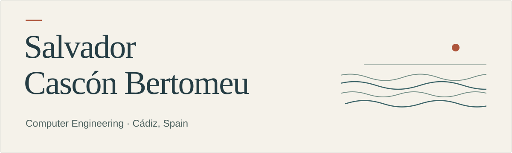

  

Hi, I'm Salvador. I recently finished a Computer Engineering degree at Loyola. During my internship, I worked with ETL workflows and operational data.

For my final-year project, I built a ransomware intelligence pipeline. It collects public reports, uses a local language model to map evidence to MITRE ATT&CK, and evaluates the results against a labelled dataset. The project gave me the chance to work across software, data and cybersecurity in one system.

**[Project and source code](https://github.com/SalvaCB-git/ransomware-intelligence-pipeline)** · **[Live demo](https://scraper.143.47.55.55.sslip.io/demo)**

I’m looking for an early-career role in software or cybersecurity. I’m especially interested in work that combines practical engineering with data or AI, and I’m open to relocating within Europe.

Based in southern Spain · EU citizen · English C1
